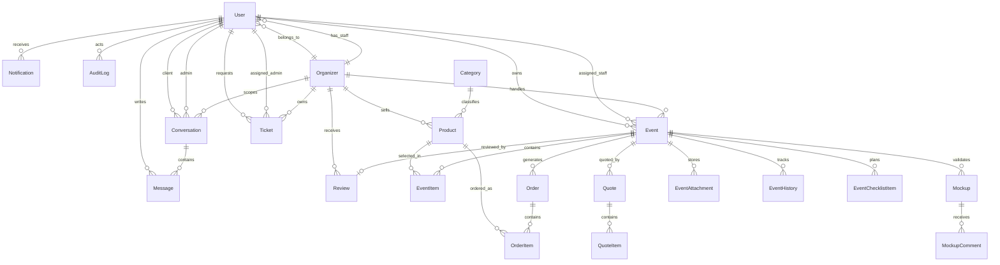

# 04 - Database

## 1. Choix moteur

- Type : PostgreSQL 16, accede via Prisma ORM.
- Justification : voir `docs/00-kickoff-pack/06-adr/ADR-001-choix-bdd.md`.
- Raison principale : EasyEvent manipule des donnees relationnelles fortes : utilisateurs, organisateurs, evenements, produits, commandes, devis, messages, tickets, notifications et historique.

PostgreSQL est le choix par defaut du projet car il apporte :

- des transactions fiables pour les commandes, devis et changements de statut ;
- des contraintes relationnelles entre entites critiques ;
- des index utiles aux recherches par periode, statut, organisation et utilisateur ;
- un schema versionne via Prisma et les migrations.

MongoDB/NoSQL n'est pas retenu pour le MVP : la flexibilite documentaire ne compense pas le besoin d'integrite relationnelle.

## 2. ERD

## 3. Dictionnaire de donnees

### Table : User

| Colonne | Type Prisma | Contraintes | Description |
|---|---|---|---|
| id | Int | PK, autoincrement | Identifiant interne utilisateur. |
| email | String | UNIQUE, NOT NULL | Email d'authentification. |
| name | String? | NULL | Nom affiche. |
| avatarUrl | String? | NULL | URL de l'avatar. |
| phone | String? | NULL | Telephone utilisateur. |
| address | String? | NULL | Adresse utilisateur. |
| password | String? | NULL | Hash du mot de passe, nullable pour compatibilite SSO future. |
| role | String | NOT NULL, default CLIENT | Role global actuel : PLATFORM_ADMIN, ORGANIZER_OWNER, ORGANIZER_STAFF, CLIENT. |
| organizerId | Int? | FK nullable vers Organizer | Organisation rattachee pour staff/owner. |
| resetToken | String? | UNIQUE, NULL | Jeton de reinitialisation de mot de passe. |
| resetTokenExpires | DateTime? | NULL | Expiration du jeton. |
| createdAt | DateTime | NOT NULL, default now | Date de creation. |
| updatedAt | DateTime | NOT NULL, auto-update | Derniere modification. |

### Table : Organizer

| Colonne | Type Prisma | Contraintes | Description |
|---|---|---|---|
| id | Int | PK, autoincrement | Identifiant interne organisateur. |
| name | String | NOT NULL | Nom commercial. |
| slug | String | UNIQUE, NOT NULL | Identifiant lisible d'URL. |
| status | String | NOT NULL, default PENDING | Statut : PENDING, APPROVED, SUSPENDED. |
| city | String? | NULL | Ville principale. |
| address | String? | NULL | Adresse. |
| serviceArea | String? | NULL | Zone d'intervention. |
| description | String? | NULL | Description commerciale. |
| coverImage | String? | NULL | Image de couverture. |
| portfolioImages | String? | NULL | Liste serialisee d'images portfolio. |
| portfolioVideos | String? | NULL | Liste serialisee de videos portfolio. |
| createdAt | DateTime | NOT NULL, default now | Date de creation. |
| updatedAt | DateTime | NOT NULL, auto-update | Derniere modification. |

### Table : Product

| Colonne | Type Prisma | Contraintes | Description |
|---|---|---|---|
| id | Int | PK, autoincrement | Identifiant interne produit/prestation. |
| name | String | NOT NULL | Nom du produit ou pack. |
| description | String? | NULL | Description. |
| price | String | NOT NULL | Prix affiche sous forme texte. |
| image | String? | NULL | Image principale. |
| gallery | String? | NULL | Galerie serialisee. |
| type | String | NOT NULL, default PRODUCT | Type : PRODUCT ou PACK. |
| variants | String? | NULL | Variantes serialisees. |
| stock | Int? | NULL | Stock disponible si applicable. |
| isAvailable | Boolean | NOT NULL, default true | Disponibilite catalogue. |
| recommendedFor | String? | NULL | Occasions recommandees, format texte. |
| organizerId | Int? | FK nullable vers Organizer | Organisateur proprietaire. |
| categoryId | Int? | FK nullable vers Category | Categorie du produit. |
| createdAt | DateTime | NOT NULL, default now | Date de creation. |
| updatedAt | DateTime | NOT NULL, auto-update | Derniere modification. |

### Table : Category

| Colonne | Type Prisma | Contraintes | Description |
|---|---|---|---|
| id | Int | PK, autoincrement | Identifiant interne categorie. |
| name | String | UNIQUE, NOT NULL | Nom de categorie. |
| slug | String | UNIQUE, NOT NULL | Identifiant lisible d'URL. |
| createdAt | DateTime | NOT NULL, default now | Date de creation. |
| updatedAt | DateTime | NOT NULL, auto-update | Derniere modification. |

### Table : EventTemplate

| Colonne | Type Prisma | Contraintes | Description |
|---|---|---|---|
| id | Int | PK, autoincrement | Identifiant interne modele. |
| name | String | NOT NULL | Nom du modele. |
| occasionType | String | NOT NULL | Type d'occasion. |
| description | String? | NULL | Description. |
| theme | String? | NULL | Theme suggere. |
| guestCount | Int? | NULL | Nombre d'invites suggere. |
| budget | Float? | NULL | Budget indicatif. |
| suggestedTags | String? | NULL | Tags suggeres serialises. |
| suggestedProductIds | String? | NULL | IDs produits suggeres serialises. |
| serviceBuffet | Boolean | NOT NULL, default false | Besoin buffet. |
| serviceDeco | Boolean | NOT NULL, default false | Besoin decoration. |
| serviceOrganisation | Boolean | NOT NULL, default false | Besoin organisation. |
| serviceGateaux | Boolean | NOT NULL, default false | Besoin gateaux. |
| serviceMobilier | Boolean | NOT NULL, default false | Besoin mobilier. |
| serviceAnimation | Boolean | NOT NULL, default false | Besoin animation. |
| serviceLieu | Boolean | NOT NULL, default false | Besoin lieu. |
| createdAt | DateTime | NOT NULL, default now | Date de creation. |
| updatedAt | DateTime | NOT NULL, auto-update | Derniere modification. |

### Table : Event

| Colonne | Type Prisma | Contraintes | Description |
|---|---|---|---|
| id | Int | PK, autoincrement | Identifiant interne evenement. |
| name | String | NOT NULL | Nom de l'evenement. |
| date | DateTime | NOT NULL | Date de l'evenement. |
| occasionType | String? | NULL | Type d'occasion. |
| theme | String? | NULL | Theme. |
| location | String? | NULL | Lieu. |
| guestCount | Int? | NULL | Nombre d'invites. |
| budget | Float? | NULL | Budget client. |
| notes | String? | NULL | Notes libres. |
| serviceBuffet | Boolean | NOT NULL, default false | Besoin buffet. |
| serviceDeco | Boolean | NOT NULL, default false | Besoin decoration. |
| serviceOrganisation | Boolean | NOT NULL, default false | Besoin organisation. |
| serviceGateaux | Boolean | NOT NULL, default false | Besoin gateaux. |
| serviceMobilier | Boolean | NOT NULL, default false | Besoin mobilier. |
| serviceAnimation | Boolean | NOT NULL, default false | Besoin animation. |
| serviceLieu | Boolean | NOT NULL, default false | Besoin lieu. |
| isSubmitted | Boolean | NOT NULL, default false | Demande soumise ou brouillon. |
| status | String | NOT NULL, default DRAFT | Statut metier. |
| statusText | String? | NULL | Libelle d'affichage du statut. |
| statusColor | String? | NULL | Couleur d'affichage du statut. |
| ownerId | Int | FK vers User, NOT NULL | Client proprietaire. |
| organizerId | Int? | FK nullable vers Organizer | Organisateur en charge. |
| assignedStaffId | Int? | FK nullable vers User | Staff assigne. |
| createdAt | DateTime | NOT NULL, default now | Date de creation. |
| updatedAt | DateTime | NOT NULL, auto-update | Derniere modification. |

### Table : Review

| Colonne | Type Prisma | Contraintes | Description |
|---|---|---|---|
| id | Int | PK, autoincrement | Identifiant interne avis. |
| eventId | Int | UNIQUE, FK vers Event | Evenement evalue. |
| organizerId | Int | FK vers Organizer | Organisateur evalue. |
| authorId | Int | FK vers User | Auteur de l'avis. |
| reviewedStaffId | Int? | FK nullable vers User | Staff evalue. |
| organizerRating | Int | NOT NULL | Note organisateur. |
| organizerComment | String? | NULL | Commentaire organisateur. |
| staffRating | Int? | NULL | Note staff. |
| staffComment | String? | NULL | Commentaire staff. |
| createdAt | DateTime | NOT NULL, default now | Date de creation. |
| updatedAt | DateTime | NOT NULL, auto-update | Derniere modification. |

### Table : PlanningBlock

| Colonne | Type Prisma | Contraintes | Description |
|---|---|---|---|
| id | Int | PK, autoincrement | Identifiant interne bloc planning. |
| title | String | NOT NULL | Titre. |
| startAt | DateTime | NOT NULL | Debut. |
| endAt | DateTime | NOT NULL | Fin. |
| reason | String? | NULL | Motif. |
| eventId | Int? | NULL | Evenement associe, sans FK Prisma actuellement. |
| createdBy | Int? | NULL | Createur, sans FK Prisma actuellement. |
| createdAt | DateTime | NOT NULL, default now | Date de creation. |
| updatedAt | DateTime | NOT NULL, auto-update | Derniere modification. |

### Table : EventChecklistItem

| Colonne | Type Prisma | Contraintes | Description |
|---|---|---|---|
| id | Int | PK, autoincrement | Identifiant interne tache. |
| eventId | Int | FK vers Event, NOT NULL | Evenement concerne. |
| title | String | NOT NULL | Titre de tache. |
| category | String? | NULL | Categorie de tache. |
| dueAt | DateTime? | NULL | Date limite. |
| isDone | Boolean | NOT NULL, default false | Etat de completion. |
| assignedToId | Int? | NULL | Assignation, sans FK Prisma actuellement. |
| createdAt | DateTime | NOT NULL, default now | Date de creation. |
| updatedAt | DateTime | NOT NULL, auto-update | Derniere modification. |

### Table : EventAttachment

| Colonne | Type Prisma | Contraintes | Description |
|---|---|---|---|
| id | Int | PK, autoincrement | Identifiant interne piece jointe. |
| eventId | Int | FK vers Event, NOT NULL | Evenement rattache. |
| name | String | NOT NULL | Nom de fichier. |
| url | String | NOT NULL | URL de stockage. |
| type | String? | NULL | Type ou MIME simplifie. |
| createdAt | DateTime | NOT NULL, default now | Date de creation. |

### Table : EventHistory

| Colonne | Type Prisma | Contraintes | Description |
|---|---|---|---|
| id | Int | PK, autoincrement | Identifiant interne historique. |
| eventId | Int | FK vers Event, NOT NULL | Evenement concerne. |
| actorId | Int? | NULL | Acteur, sans FK Prisma actuellement. |
| action | String | NOT NULL | Action realisee. |
| fromStatus | String? | NULL | Ancien statut. |
| toStatus | String? | NULL | Nouveau statut. |
| details | String? | NULL | Details contextuels. |
| createdAt | DateTime | NOT NULL, default now | Date de creation. |

### Table : EventItem

| Colonne | Type Prisma | Contraintes | Description |
|---|---|---|---|
| id | Int | PK, autoincrement | Identifiant interne ligne evenement. |
| eventId | Int | FK vers Event, unique avec productId | Evenement concerne. |
| productId | Int | FK vers Product, unique avec eventId | Produit selectionne. |
| quantity | Int | NOT NULL, default 1 | Quantite. |
| note | String? | NULL | Note client ou organisateur. |
| variant | String? | NULL | Variante choisie. |
| reservedUntil | DateTime? | NULL | Fin de reservation temporaire. |
| createdAt | DateTime | NOT NULL, default now | Date de creation. |

### Table : Order

| Colonne | Type Prisma | Contraintes | Description |
|---|---|---|---|
| id | Int | PK, autoincrement | Identifiant interne commande. |
| eventId | Int | FK vers Event, NOT NULL | Evenement commande. |
| clientId | Int | NOT NULL | Client, sans FK Prisma actuellement. |
| status | String | NOT NULL, default PENDING | Statut : PENDING, CONFIRMED, CANCELLED. |
| deliveryAddress | String? | NULL | Adresse de livraison. |
| deliverySlot | String? | NULL | Creneau de livraison. |
| clientNotes | String? | NULL | Notes client. |
| deliveryFee | Float | NOT NULL, default 0 | Frais de livraison figes. |
| installationFee | Float | NOT NULL, default 0 | Frais d'installation figes. |
| subtotalFixed | Float | NOT NULL, default 0 | Sous-total snapshot. |
| totalFixed | Float | NOT NULL, default 0 | Total snapshot. |
| hasQuoteItems | Boolean | NOT NULL, default false | Contient des elements issus d'un devis. |
| reservedUntil | DateTime? | NULL | Fin de reservation. |
| createdAt | DateTime | NOT NULL, default now | Date de creation. |
| updatedAt | DateTime | NOT NULL, auto-update | Derniere modification. |

### Table : OrderItem

| Colonne | Type Prisma | Contraintes | Description |
|---|---|---|---|
| id | Int | PK, autoincrement | Identifiant interne ligne commande. |
| orderId | Int | FK vers Order, NOT NULL | Commande rattachee. |
| productId | Int? | FK nullable vers Product | Produit catalogue optionnel. |
| name | String | NOT NULL | Nom snapshot au moment de commande. |
| priceLabel | String | NOT NULL | Prix affiche snapshot. |
| unitPrice | Float? | NULL | Prix unitaire snapshot. |
| quantity | Int | NOT NULL | Quantite. |
| note | String? | NULL | Note ligne. |
| variant | String? | NULL | Variante snapshot. |
| lineTotal | Float? | NULL | Total ligne snapshot. |
| createdAt | DateTime | NOT NULL, default now | Date de creation. |

### Table : QuoteTemplate

| Colonne | Type Prisma | Contraintes | Description |
|---|---|---|---|
| id | Int | PK, autoincrement | Identifiant interne modele devis. |
| name | String | NOT NULL | Nom du modele. |
| description | String? | NULL | Description. |
| calculationMode | String | NOT NULL, default MIXED | Mode : PER_GUEST, PACKAGE, MIXED. |
| defaultDeposit | Float? | NULL | Acompte par defaut. |
| terms | String? | NULL | Conditions par defaut. |
| createdAt | DateTime | NOT NULL, default now | Date de creation. |
| updatedAt | DateTime | NOT NULL, auto-update | Derniere modification. |

### Table : Quote

| Colonne | Type Prisma | Contraintes | Description |
|---|---|---|---|
| id | Int | PK, autoincrement | Identifiant interne devis. |
| eventId | Int | FK vers Event, NOT NULL | Evenement rattache. |
| templateId | Int? | NULL | Modele utilise, sans FK Prisma actuellement. |
| number | String | NOT NULL | Numero de devis. |
| status | String | NOT NULL, default DRAFT | Statut : DRAFT, SENT, ACCEPTED, REFUSED. |
| calculationMode | String | NOT NULL, default MIXED | Mode de calcul. |
| subtotal | Float | NOT NULL, default 0 | Sous-total snapshot. |
| deliveryFee | Float | NOT NULL, default 0 | Frais de livraison snapshot. |
| installationFee | Float | NOT NULL, default 0 | Frais d'installation snapshot. |
| discount | Float | NOT NULL, default 0 | Remise snapshot. |
| total | Float | NOT NULL, default 0 | Total snapshot. |
| depositAmount | Float? | NULL | Montant d'acompte. |
| depositRequired | Boolean | NOT NULL, default false | Acompte requis. |
| clientComment | String? | NULL | Commentaire client. |
| organizerComment | String? | NULL | Commentaire organisateur. |
| terms | String? | NULL | Conditions snapshot. |
| sentAt | DateTime? | NULL | Date d'envoi. |
| decidedAt | DateTime? | NULL | Date de decision. |
| createdBy | Int? | NULL | Createur, sans FK Prisma actuellement. |
| createdAt | DateTime | NOT NULL, default now | Date de creation. |
| updatedAt | DateTime | NOT NULL, auto-update | Derniere modification. |

### Table : QuoteItem

| Colonne | Type Prisma | Contraintes | Description |
|---|---|---|---|
| id | Int | PK, autoincrement | Identifiant interne ligne devis. |
| quoteId | Int | FK vers Quote, NOT NULL | Devis rattache. |
| label | String | NOT NULL | Libelle snapshot. |
| description | String? | NULL | Description snapshot. |
| strategy | String | NOT NULL, default FIXED | Strategie : FIXED, PER_GUEST, PACKAGE, QUOTE. |
| unitPrice | Float? | NULL | Prix unitaire snapshot. |
| quantity | Int | NOT NULL, default 1 | Quantite. |
| guestCount | Int? | NULL | Nombre d'invites utilise. |
| lineTotal | Float? | NULL | Total ligne snapshot. |
| createdAt | DateTime | NOT NULL, default now | Date de creation. |

### Table : Mockup

| Colonne | Type Prisma | Contraintes | Description |
|---|---|---|---|
| id | Int | PK, autoincrement | Identifiant interne maquette. |
| eventId | Int | FK vers Event, NOT NULL | Evenement rattache. |
| title | String | NOT NULL | Titre. |
| url | String | NOT NULL | URL de fichier. |
| fileType | String | NOT NULL, default image | Type : image, pdf, canva. |
| version | Int | NOT NULL, default 1 | Version de maquette. |
| status | String | NOT NULL, default PENDING | Statut : PENDING, APPROVED, CHANGES_REQUESTED. |
| description | String? | NULL | Description. |
| moodboard | String? | NULL | Moodboard serialise ou texte. |
| createdBy | Int? | NULL | Createur, sans FK Prisma actuellement. |
| decidedAt | DateTime? | NULL | Date de validation ou demande de modification. |
| createdAt | DateTime | NOT NULL, default now | Date de creation. |
| updatedAt | DateTime | NOT NULL, auto-update | Derniere modification. |

### Table : MockupComment

| Colonne | Type Prisma | Contraintes | Description |
|---|---|---|---|
| id | Int | PK, autoincrement | Identifiant interne commentaire. |
| mockupId | Int | FK vers Mockup, NOT NULL | Maquette rattachee. |
| authorId | Int? | NULL | Auteur, sans FK Prisma actuellement. |
| authorRole | String? | NULL | Role de l'auteur au moment du commentaire. |
| text | String | NOT NULL | Contenu du commentaire. |
| createdAt | DateTime | NOT NULL, default now | Date de creation. |

### Table : Conversation

| Colonne | Type Prisma | Contraintes | Description |
|---|---|---|---|
| id | Int | PK, autoincrement | Identifiant interne conversation. |
| clientId | Int | FK vers User, unique avec adminId | Client. |
| adminId | Int | FK vers User, unique avec clientId | Interlocuteur admin/staff. |
| organizerId | Int? | FK nullable vers Organizer | Organisation concernee. |
| createdAt | DateTime | NOT NULL, default now | Date de creation. |
| updatedAt | DateTime | NOT NULL, auto-update | Derniere modification. |
| clientLastReadAt | DateTime? | NULL | Derniere lecture client. |
| staffLastReadAt | DateTime? | NULL | Derniere lecture staff/admin. |

### Table : Message

| Colonne | Type Prisma | Contraintes | Description |
|---|---|---|---|
| id | Int | PK, autoincrement | Identifiant interne message. |
| conversationId | Int | FK vers Conversation, NOT NULL | Conversation rattachee. |
| sender | String | NOT NULL | Type ou libelle d'expediteur. |
| text | String | NOT NULL | Contenu texte. |
| timestamp | String | NOT NULL | Horodatage historique cote application. |
| authorId | Int? | FK nullable vers User | Auteur lie. |
| attachmentUrl | String? | NULL | URL piece jointe. |
| attachmentName | String? | NULL | Nom piece jointe. |
| attachmentType | String? | NULL | Type piece jointe. |
| linkType | String? | NULL | Type de ressource liee. |
| linkId | Int? | NULL | Identifiant de ressource liee. |
| readAt | DateTime? | NULL | Date de lecture. |
| createdAt | DateTime | NOT NULL, default now | Date de creation. |

### Table : Notification

| Colonne | Type Prisma | Contraintes | Description |
|---|---|---|---|
| id | Int | PK, autoincrement | Identifiant interne notification. |
| userId | Int? | FK nullable vers User | Destinataire utilisateur. |
| role | String? | NULL | Destinataire par role. |
| type | String | NOT NULL | Type fonctionnel. |
| title | String | NOT NULL | Titre. |
| body | String? | NULL | Detail. |
| linkType | String? | NULL | Type de ressource liee. |
| linkId | Int? | NULL | Identifiant de ressource liee. |
| isRead | Boolean | NOT NULL, default false | Notification lue. |
| createdAt | DateTime | NOT NULL, default now | Date de creation. |

### Table : Ticket

| Colonne | Type Prisma | Contraintes | Description |
|---|---|---|---|
| id | Int | PK, autoincrement | Identifiant interne ticket. |
| organizerId | Int | FK vers Organizer, NOT NULL | Organisation concernee. |
| requesterId | Int | FK vers User, NOT NULL | Demandeur. |
| assignedAdminId | Int? | FK nullable vers User | Admin assigne. |
| title | String | NOT NULL | Titre. |
| description | String | NOT NULL | Description. |
| status | String | NOT NULL, default OPEN | Statut : OPEN, IN_PROGRESS, RESOLVED, REFUSED. |
| createdAt | DateTime | NOT NULL, default now | Date de creation. |
| updatedAt | DateTime | NOT NULL, auto-update | Derniere modification. |
| resolvedAt | DateTime? | NULL | Date de resolution. |

### Table : QuickMessageTemplate

| Colonne | Type Prisma | Contraintes | Description |
|---|---|---|---|
| id | Int | PK, autoincrement | Identifiant interne modele message. |
| title | String | NOT NULL | Titre du modele. |
| body | String | NOT NULL | Corps du message. |
| role | String | NOT NULL, default PLATFORM_ADMIN | Role proprietaire ou cible. |
| createdAt | DateTime | NOT NULL, default now | Date de creation. |
| updatedAt | DateTime | NOT NULL, auto-update | Derniere modification. |

### Table : AuditLog

| Colonne | Type Prisma | Contraintes | Description |
|---|---|---|---|
| id | Int | PK, autoincrement | Identifiant interne audit. |
| actorId | Int? | FK nullable vers User | Acteur de l'action. |
| action | String | NOT NULL | Action realisee. |
| entity | String? | NULL | Entite concernee. |
| entityId | String? | NULL | Identifiant de l'entite concernee. |
| details | String? | NULL | Details ou payload simplifie. |
| createdAt | DateTime | NOT NULL, default now | Date de creation. |

## 4. Index prevus

Index deja presents par contraintes :

- `User(email)` : unique, authentification.
- `User(resetToken)` : unique, reinitialisation de mot de passe.
- `Organizer(slug)` : unique, URL organisateur.
- `Category(name)` : unique, gestion catalogue.
- `Category(slug)` : unique, URL categorie.
- `Review(eventId)` : unique, un avis par evenement.
- `EventItem(eventId, productId)` : unique, evite les doublons produit dans un evenement.
- `Conversation(clientId, adminId)` : unique, une conversation par binome.

Index a ajouter explicitement dans Prisma pour les requetes frequentes :

- `Event(ownerId, createdAt)` : liste des demandes client.
- `Event(organizerId, status, date)` : planning et back-office organisateur.
- `Event(assignedStaffId, status, date)` : planning staff.
- `Order(eventId, createdAt)` : commandes d'un evenement.
- `Quote(eventId, status)` : devis par evenement et statut.
- `Product(organizerId, categoryId, isAvailable)` : catalogue organisateur.
- `Message(conversationId, createdAt)` : affichage conversation.
- `Notification(userId, isRead, createdAt)` : centre de notifications.
- `Ticket(organizerId, status, createdAt)` : support.
- `AuditLog(entity, entityId, createdAt)` : recherche audit.
- `EventHistory(eventId, createdAt)` : timeline evenement.

## 5. Anti-patterns evites ou a corriger

### Evites

- Pas de table fourre-tout `data` : chaque concept principal a sa table dediee.
- Les commandes et devis snapshotent les montants et libelles critiques : `Order.subtotalFixed`, `Order.totalFixed`, `OrderItem.name`, `OrderItem.priceLabel`, `Quote.total`, `QuoteItem.label`, `QuoteItem.unitPrice`.
- L'historique des changements importants existe via `EventHistory` et `AuditLog`.
- Les ressources indisponibles peuvent etre conservees sans suppression physique via `Product.isAvailable`.

### A corriger en priorite

- IDs publics auto-incrementes : le schema utilise des `Int @id @default(autoincrement())`. Pour les ressources exposees en URL, ajouter un identifiant opaque `publicId` en UUID ou migrer les PK vers UUID.
- Soft delete incomplet : la plupart des tables n'ont pas `deletedAt`. A ajouter sur `User`, `Organizer`, `Product`, `Category`, `Event`, `Order`, `Quote`, `Mockup`, `Conversation`, `Ticket`.
- Audit incomplet : peu de tables ont `createdBy` / `updatedBy`. A ajouter sur les entites modifiees par des humains : `Event`, `Product`, `Order`, `Quote`, `Mockup`, `Ticket`.
- Role utilisateur trop global : `User.role` suffit pour un MVP simple, mais une table de membership serait plus robuste si un utilisateur peut appartenir a plusieurs organisations avec des roles differents.
- Valeurs multiples dans une colonne : `portfolioImages`, `portfolioVideos`, `gallery`, `variants`, `suggestedTags`, `suggestedProductIds` devraient etre normalises ou stockes en JSON type.
- Relations sans FK Prisma : `PlanningBlock.eventId`, `PlanningBlock.createdBy`, `EventChecklistItem.assignedToId`, `EventHistory.actorId`, `Order.clientId`, `Quote.templateId`, `Quote.createdBy`, `Mockup.createdBy`, `MockupComment.authorId` devraient devenir de vraies relations.
- Argent stocke en `Float` ou texte : remplacer les montants par des entiers en centimes (`amountCents`) et garder `currency` quand necessaire.
- Champs de statut en `String` libre : remplacer progressivement par des enums Prisma pour `role`, `status`, `type`, `strategy`, `calculationMode`.

## 6. Champs sentinelles cibles

Pour les nouvelles tables et les prochaines migrations, la cible est :

| Champ | Type cible | Regle |
|---|---|---|
| id | uuid ou Int interne + publicId uuid | Identifiant stable, opaque pour exposition publique. |
| createdAt | DateTime | Obligatoire, default now. |
| updatedAt | DateTime | Obligatoire si l'entite est modifiable. |
| deletedAt | DateTime? | Nullable pour soft delete sur entites metier. |
| createdBy | FK User nullable | Requis sur les actions humaines tracables. |
| updatedBy | FK User nullable | Requis sur les actions humaines tracables. |

## 7. Regles de conception pour les prochaines migrations

- Toute donnee critique affichee dans une facture, commande ou devis doit etre snapshottee au moment de la transaction.
- Toute colonne filtree regulierement doit etre indexee.
- Toute relation metier stable doit etre une FK Prisma, pas un simple `Int`.
- Toute liste requetable doit etre une table de liaison ou un type JSON indexable, pas une chaine separee par des virgules.
- Toute ressource exposee publiquement doit utiliser un identifiant opaque.
- Toute suppression utilisateur doit passer par un soft delete quand l'historique metier doit rester lisible.
