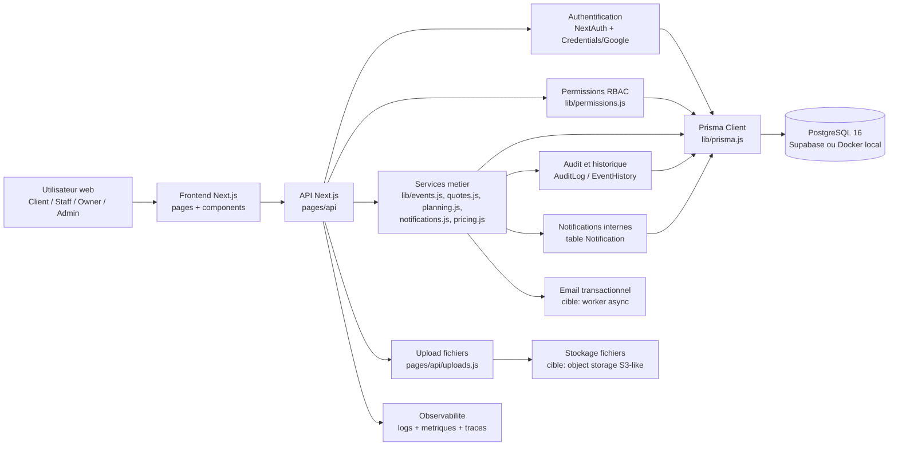

# 05 - Architecture

## 1. Schema de composants

Architecture cible MVP :

- Un seul projet Next.js pour accelerer le MVP : interface React, routes API et logique serveur dans le meme depot.
- Une API REST interne sous `pages/api`, appelee par les pages et composants.
- Une couche services dans `lib/*` pour les regles metier, afin d'eviter de les disperser dans le front ou directement dans les routes API.
- Prisma comme acces unique a PostgreSQL.
- NextAuth pour l'identite, avec RBAC explicite cote serveur.
- Audit et historique des actions sensibles des le MVP.
- Stockage fichiers et email traites comme dependances externes, meme si leur implementation peut etre simplifiee au demarrage.

## 2. Flux principaux

### Flux auth : connexion email/mot de passe

1. L'utilisateur soumet email et mot de passe depuis l'interface.
2. NextAuth route la tentative vers `pages/api/auth/[...nextauth].js`.
3. Le provider Credentials appelle `verifyCredentials` dans `lib/auth.js`.
4. `lib/auth.js` normalise l'email, charge l'utilisateur via Prisma et compare le mot de passe avec bcrypt.
5. Si les credentials sont valides, NextAuth cree une session JWT.
6. Les callbacks NextAuth ajoutent au token les informations utiles : `id`, `role`, `organizerId`, `organizerStatus`.
7. Les routes API suivantes lisent la session et appliquent les permissions cote serveur.

Points de vigilance :

- Le hash actuel est cree avec bcrypt cost 10 dans `pages/api/auth/register.js`; la cible securite est cost 12 minimum.
- Le rate limiting sur login n'est pas encore visible dans le code et doit etre ajoute avant production.
- Les secrets NextAuth, OAuth et base de donnees doivent rester en variables d'environnement.

### Flux inscription organisateur

1. L'utilisateur choisit un compte organisateur et renseigne ses informations.
2. `pages/api/auth/register.js` valide les champs obligatoires.
3. L'API bloque l'inscription avec l'email reserve a l'administrateur plateforme.
4. L'API verifie l'unicite de l'email.
5. Une transaction Prisma cree l'organisateur avec le statut `PENDING`, puis l'utilisateur avec le role `ORGANIZER_OWNER`.
6. `writeAudit` journalise `USER_REGISTERED`.
7. L'admin plateforme pourra ensuite approuver ou suspendre l'organisation.

### Flux creation et suivi evenement

1. Le client cree une demande depuis le front.
2. La route API `pages/api/events.js` valide les entrees et la session.
3. Les regles metier d'evenement vivent dans `lib/events.js` et les helpers associes.
4. Prisma persiste l'evenement et ses relations : client, organisateur, items, pieces jointes, checklist.
5. Les changements de statut passent par la machine a etats documentee dans `03-domain-model.md`.
6. `EventHistory` trace les transitions importantes.
7. `Notification` informe le client, l'organisateur ou le staff selon l'action.

### Flux devis

1. L'organisateur ouvre un evenement autorise par son perimetre RBAC.
2. L'API verifie la session et la permission `events:manage` ou le perimetre equivalent.
3. `lib/quotes.js` construit les lignes de devis depuis les items d'evenement.
4. Les montants, libelles et conditions sont snapshots dans `Quote` et `QuoteItem`.
5. Le devis suit les statuts `DRAFT`, `SENT`, `ACCEPTED`, `REFUSED`.
6. Une decision client renseigne `decidedAt` et conserve l'historique contractuel.

### Flux support / audit

1. Un utilisateur cree ou met a jour un ticket support.
2. L'API verifie son role et son perimetre.
3. Prisma persiste le ticket, son statut et son assignation.
4. Les actions sensibles sont journalisees dans `AuditLog`.
5. Les admins consultent l'audit via `pages/api/admin/audit.js`.

## 3. Matrice des responsabilites

| Capacite | Responsable | Pas le role de |
|---|---|---|
| Affichage et interactions | Frontend React | Porter la securite ou les regles critiques |
| Validation des entrees | Route API, endpoint par endpoint | Front seul |
| Authentification | NextAuth + `lib/auth.js` | Composants React |
| Permissions RBAC | API + `lib/permissions.js` | Masquage visuel des boutons |
| Regles metier evenement | Couche service `lib/events.js` | Triggers SQL ou composants UI |
| Regles metier devis/prix | `lib/quotes.js` + `lib/pricing.js` | Base de donnees seule |
| Integrite referentielle | PostgreSQL + Prisma schema | Code applicatif uniquement |
| Transactions critiques | Prisma `$transaction` | Plusieurs appels independants non controles |
| Historique evenement | `EventHistory` via service/API | Commentaires libres ou logs console |
| Audit securite/metier | `AuditLog` via `lib/audit.js` | Frontend |
| Notifications internes | `lib/notifications.js` + table `Notification` | Requete UI manuelle |
| Emails transactionnels | Service email, cible worker async | Bloquer longtemps la requete HTTP |
| Stockage fichiers | Object storage S3-like cible | Disque local serveur en production |
| Secrets | Variables d'environnement | Code source ou Git |
| Logs techniques | Serveur API / plateforme d'hebergement | Alertes utilisateur |
| Tests automatises | `tests/unit` + pipeline CI cible | Verification manuelle uniquement |

Regle de lecture : si une capacite apparait dans plusieurs couches, la couche responsable ci-dessus tranche. Les autres couches peuvent aider, mais ne doivent pas garantir seules le comportement.

## 4. Securite by design

Checklist actuelle et cible :

| Reflexe | Statut | Decision |
|---|---|---|
| Auth solide | Partiel | NextAuth est en place. Monter bcrypt de 10 a 12 et ajouter rate limiting login. |
| Secrets jamais en dur | Partiel | `.env` est ignore par Git. Les valeurs de demo dans `docker-compose.yml` doivent rester non-prod. |
| HTTPS partout | Cible prod | A imposer via l'hebergeur, sans fallback HTTP en production. |
| RGPD donnees perso | A cadrer | Inventaire, durees de conservation et droit effacement a documenter avant prod. |
| OWASP Top 10 awareness | En cours | RBAC cote serveur present. Ajouter protections explicites contre IDOR, CSRF selon endpoints, XSS et upload abusif. |
| Audit log jour 1 | Present | `AuditLog` existe et `writeAudit` est disponible. Etendre aux changements de role, suppressions, login sensibles. |

Checklist operationnelle avant production :

- [x] `.env` ignore par Git.
- [x] NextAuth utilise `NEXTAUTH_SECRET`.
- [x] RBAC centralise dans `lib/permissions.js`.
- [x] AuditLog disponible via `lib/audit.js`.
- [ ] bcrypt cost 12 minimum pour les nouveaux mots de passe.
- [ ] Rate limiting sur `/api/auth/*` et endpoints sensibles.
- [ ] HTTPS force en production avec HSTS.
- [ ] Politique RGPD : collecte, retention, export, suppression.
- [ ] Validation serveur systematique des payloads API.
- [ ] Controle anti-IDOR sur chaque ressource exposee par ID.
- [ ] Politique d'upload : taille max, type MIME, scan ou restrictions.

## 5. Observabilite minimale

### Logs

Etat actuel :

- Logs applicatifs ponctuels via `console.error`.
- Audit metier persiste en base via `AuditLog`.
- Historique evenement persiste via `EventHistory`.

Cible MVP :

- Logs structures JSON avec niveaux `info`, `warn`, `error`.
- Correlation ID par requete API.
- Aucun secret ni mot de passe dans les logs.
- Centralisation via la plateforme d'hebergement ou un outil dedie.

Outil propose : Pino cote serveur Next.js, puis aggregation Vercel/Supabase logs ou equivalent.

### Metriques

Metriques minimales a suivre :

- Latence API p50, p95, p99.
- Taux d'erreur 4xx/5xx par endpoint.
- Nombre de creations evenement/devis/commande.
- Taux d'echec login et reset password.
- Usage PostgreSQL : connexions, CPU, RAM, requetes lentes.
- Taille du stockage fichiers.

Outil propose : metriques hebergeur + Supabase/PostgreSQL, puis Prometheus/Grafana si l'infra devient dediee.

### Traces

Cible V1.1 :

- Sentry pour erreurs front/back et contexte de session non sensible.
- OpenTelemetry si l'application sort du monolithe Next.js ou ajoute des workers.
- Trace ID propage depuis l'API vers les services metier et logs.

## 6. Reservations pour la suite

### Design patterns

Decision de cadrage :

- Garder une architecture simple : API route -> service metier -> Prisma.
- Les routes API gerent HTTP, session, validation d'entree et codes retour.
- Les services `lib/*` portent les regles metier testables.
- Prisma reste l'adapter de persistance ; eviter de dupliquer un repository abstrait tant que le besoin n'est pas reel.
- Introduire des DTO/schema validators pour stabiliser les entrees API.

Patterns a reserver :

- Service layer pour evenements, devis, planning, notifications.
- Factory/builder pour construire devis et lignes de commande.
- Policy/RBAC helpers pour les droits.
- Repository seulement si les requetes deviennent complexes ou si une extraction backend est prevue.

### Docker

Etat actuel :

- `Dockerfile` present.
- `docker-compose.yml` present avec app Next.js et PostgreSQL 16.
- Le mode dev expose l'app sur `3001` et PostgreSQL sur `5432`.

Regles :

- Docker sert a reproduire l'environnement dev et a preparer staging/prod.
- Les secrets de `docker-compose.yml` sont des valeurs locales, pas des secrets production.
- Les migrations Prisma doivent etre executees de facon controlee en staging/prod, pas uniquement via `db push`.

### CI/CD

Cible :

- GitHub Actions ou equivalent.
- Pipeline minimal : install, Prisma generate, tests unitaires, build Next.js.
- Tests bloquants sur branche principale.
- Variables d'environnement configurees dans le provider CI, jamais dans le depot.
- Deploiement automatisable avec rollback possible.

Commandes candidates :

- `npm run test:unit`
- `npm run build`
- `npm run prisma:generate`

### Cache et workers

Non requis pour le MVP, mais emplacement reserve :

- Redis possible pour rate limiting, files de jobs et cache de lecture.
- Worker asynchrone pour emails, notifications externes, nettoyage de fichiers et relances.
- Aucun microservice a creer au cadrage tant que le monolithe Next.js suffit.

## 7. Decisions et dettes techniques suivies

Decisions acceptees :

- Next.js full-stack pour limiter le nombre de briques.
- PostgreSQL + Prisma pour les donnees relationnelles.
- NextAuth + RBAC explicite pour l'identite et les permissions.
- Couche service dans `lib/*` pour eviter que la logique metier vive dans les composants.

Dettes a traiter avant production :

- Monter bcrypt a cost 12.
- Ajouter rate limiting sur login, inscription, reset password et uploads.
- Remplacer les IDs publics auto-incrementes par UUID/public IDs pour les routes exposees.
- Completer soft delete et audit fields sur les entites critiques.
- Normaliser ou typer JSON les champs qui stockent des listes.
- Ajouter logs structures et correlation ID.
- Mettre en place un pipeline CI bloquant.
